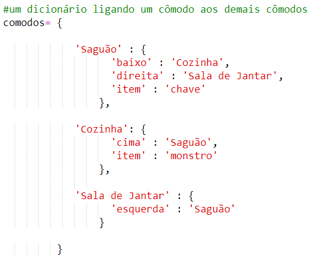

## Adicionando inimigos

Este jogo é muito fácil! Vamos adicionar inimigos a algumas salas que o jogador deve evitar.

+ Adicionar um inimigo a uma sala é tão fácil quanto adicionar qualquer outro item. Vamos adicionar um monstro faminto à cozinha:
    
    

+ Você também quer ter certeza de que o jogo termina se o jogador entrar em uma sala com um monstro. Você pode fazer isso com o seguinte código, que você deve adicionar ao final do jogo:
    
    
    
    Este código verifica se existe um item na sala e, em caso afirmativo, se esse item é um monstro. Observe que esse código é recuado, colocando-o de acordo com o código acima dele. Isto significa que o jogo irá procurar por um monstro toda vez que o jogador se mudar para uma nova sala.

+ Teste seu código indo até a cozinha, que agora contém um monstro.
    
    