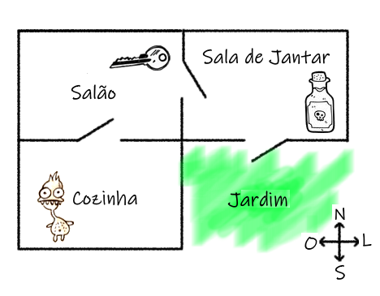
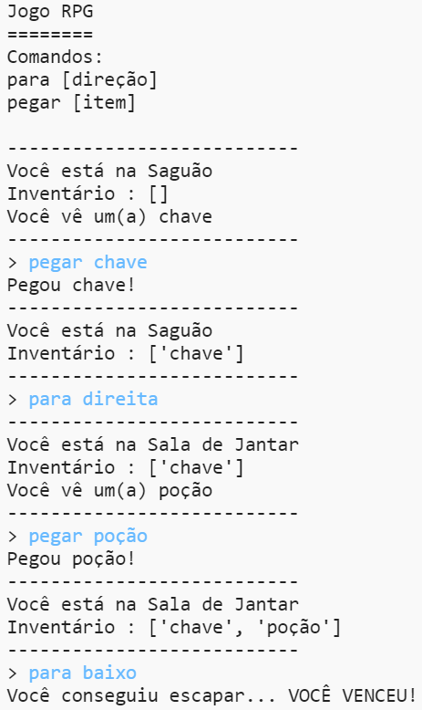
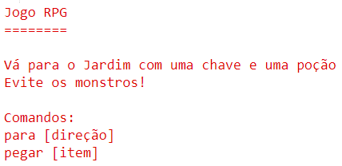

## Vencendo o jogo

Vamos dar ao seu jogador uma missão, que precisa ser concluída para ganhar o jogo.

\--- task \---

Neste jogo, o jogador ganha ao chegar ao jardim e fugir da casa. Ele também precisa pegar a chave e a poçāo antes de chegar ao jardim. Aqui está o mapa do jogo.

\--- /task \---

\--- task \---

Primeiro você precisa adicionar um jardim ao sul da sala de jantar. Lembre-se de adicionar portas, para ligar a outros cômodos da casa.

## \--- code \---

language: python

## line_highlights: 16-17,18-22

# um dicionário ligando um cômodo aos demais cômodos

comodos= {

            'Saguão' : {
                'baixo' : 'Cozinha',
                'direita' : 'Sala de Jantar',
                'item' : 'chave'
            },
    
            'Cozinha' : {
                'cima' : 'Saguão',
                'item' : 'monstro'
            },
    
            'Sala de Jantar' : {
                'esquerda' : 'Saguão'
            }
    
        }
    

\--- /code \---

\--- /task \---

\--- task \---

Adicione uma poção na sala de jantar (ou em outro cômodo da sua casa).

## \--- code \---

language: python

## line_highlights: 3-4

            'Sala de Jantar' : {
                'esquerda' : 'Saguão',
                'baixo' : 'Jardim",
                'item' : 'Poção'
            },
    

\--- /code \---

\--- /task \---

\--- task \---

Adicione este código para permitir que o jogador ganhe o jogo quando chegar ao jardim com a chave e a poção:

## \--- code \---

language: python

## line_highlights: 6-9

# o jogador perde se entrar em um cômodo com um monstro

if "item" in comodos\[comodoAtual] and 'monstro' in comodos[comodoAtual\]\['item'\]: print('O monstro te pegou... FIM DE JOGO!') break

# o jogador ganha se entrar no jardim com a chave e a poçāo

if comodoAtual == 'Jardim' and 'chave' in inventario and 'poção' in inventario: print('Você conseguiu escapar... VOCÊ VENCEU!') break

\--- /code \---

Verifique se esse código está recuado, de acordo com o código acima dele. Este código exibirá a mensagem `Você conseguiu escapar... VOCÊ VENCEU!` se o jogador estiver no cômodo 4 (Jardim) e se a chave e a poção estiverem no inventário.

Se você tem mais de 4 cômodos, pode ser necessário usar um número de cômodo diferente para o seu jardim no código acima.

\--- /task \---

\--- task \---

Teste o seu jogo para se certificar de que o jogador pode ganhar!

\--- /task \---

\--- task \---

Finalmente, vamos adicionar algumas instruções ao seu jogo, para que o jogador saiba o que deve fazer. Edita a funçāo `mostraInstrucoes()` para incluir mais informações.

## \--- code \---

language: python

## line_highlights: 7-8

def mostraInstrucoes(): #exibe o menu principal e os possíveis comandos print('''

# Jogo RPG

Vá para o Jardim com uma chave e uma poção Evite os monstros!

Comandos: para [direçāo] pegar [item] ''')

\--- /code \---

Você precisará adicionar instruções para informar ao usuário quais itens eles precisam coletar e o que deve evitar!

\--- /task \---

\--- task \---

Teste seu jogo e você verá suas novas instruções.

\--- /task \---