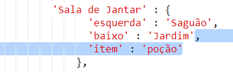
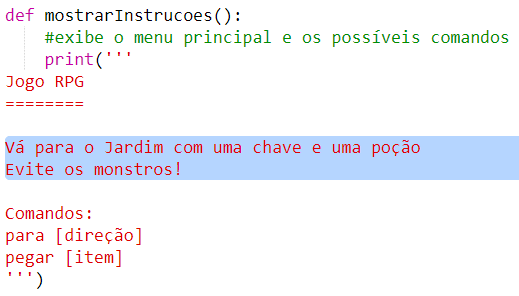

## Ganhando o jogo

Vamos dar ao seu jogador uma missão, que precisa ser concluída para ganhar o jogo.

+ Neste jogo, o jogador ganha chegando ao jardim e escapando da casa. Eles também precisam ter a chave e a poção mágica. Aqui está um mapa do jogo.
    
    

+ Primeiro, você precisa adicionar um jardim ao sul da sala de jantar. Lembre-se de adicionar portas, para ligar a outros cômodos da casa.
    
    

+ Adicione uma poção na sala de jantar (ou em outro cômodo da sua casa).
    
    

+ Adicione este código para permitir que o jogador ganhe o jogo quando chegar ao jardim com a chave e a poção:
    
    
    
    Verifique se esse código está recuado, de acordo com o código acima dele. Este código significa que a mensagem `Você escapou da casa ... VOCÊ GANHA!` é exibido se o jogador estiver no quarto 4 (o jardim) e se a chave e a poção estiverem no inventário.
    
    Se você tem mais de 4 quartos, pode ser necessário usar um número de quarto diferente para o seu jardim no código acima.

+ Teste o seu jogo para se certificar de que o jogador pode ganhar!
    
    

+ Finalmente, vamos adicionar algumas instruções ao seu jogo, para que o jogador saiba o que deve fazer. Edite a função `showInstructions ()` para incluir mais informações.
    
    
    
    Você precisará adicionar instruções para informar ao usuário quais itens eles precisam coletar e o que precisam evitar!

+ Teste seu jogo e você verá suas novas instruções.
    
    