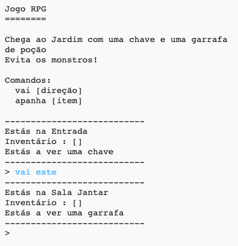

## Introdução:

Neste projeto, vais projetar e programar o teu próprio jogo de labirinto RPG. O objetivo do jogo vai ser apanhar objetos e escapar de uma casa, evitando todos os monstros!

## O que vais fazer

\--- no-print \---

Escreve `vai` e uma direçāo (norte, este, sul ou oeste) para te moveres à volta do mundo (e.g. `vai norte`).

Escreve `apanha` para apanhar qualquer item que estejas a ver (e.g. `apanha chave`).

  <iframe src="https://trinket.io/embed/python/d06adeb527?outputOnly=true&start=result" width="600" height="500" frameborder="0" marginwidth="0" marginheight="0" allowfullscreen>
  </iframe>
  

\--- /no-print \---

\--- print-only \---

\--- /print-only \---

\--- collapse \---

* * *

## title: O que vais precisar

### Hardware

+ Um computador com capacidade para executar Python

### Software

+ Python 3 (ou [online](https://trinket.io/){:target="_ blank"} ou [offline](https://www.python.org/downloads/){:target="_ blank"})

### Downloads

O projeto inicial pode ser encontrado [aqui](http://rpf.io/p/en/rpg-go){:target="_blank"}.

\--- /collapse \---

\--- collapse \---

* * *

## title: O que vais aprender

+ Desenho de jogos;
+ Ediçāo de: 
    + Listas;
    + Dicionários.
+ Expressões booleanas.

Este projeto abrange elementos das seguintes áreas do [ Curriculo Raspberry Pi Digital Making ](http://rpf.io/curriculum):

+ [Combinar construções de programação para resolver um problema.](https://www.raspberrypi.org/curriculum/programming/builder)

\--- /collapse \---

\--- collapse \---

* * *

## title: Informações adicionais para educadores

Se precisar imprimir este projeto, por favor, use a [versão para impressão](https://projects.raspberrypi.org/en/projects/rpg/print).

Pode encontrar o [projeto concluído aqui](http://rpf.io/p/en/rpg-get){:target="_ blank"}.

\--- /collapse \---