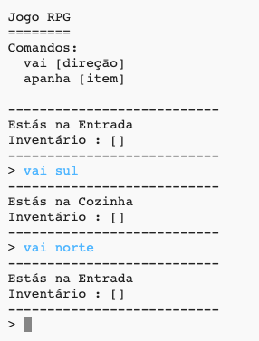
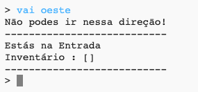
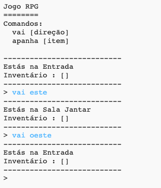

## Adicionar novas divisões

\--- task \--- Abre o projeto inicial em Python.

**Online:** abre o projeto Python inicial em [rpf.io/rpgon](http://rpf.io/rpgon){:target="_blank"}.

**Offline**: Abre o [projecto inicial](http://rpf.io/p/en/rpg-go){:target="_blank"} no editor offline. \--- /task \---

\--- task \--- Este é um jogo RPG muito básico com apenas 2 divisões. Aqui está um mapa do jogo:

Podes digitar `vai sul` para ir da entrada para a cozinha, e depois `vai norte` para voltar para a entrada!

 \--- /task \---

\--- task \--- O que acontece quando digitas uma direcāo para a qual nāo podes ir? Digita `vai oeste` no hall e vais receber uma simpática mensagem de erro.

 \--- /task \---

\--- task \--- Se olhares para a variável `divisoes`, podes ver que o mapa é codificado como um dicionário de divisões:

## \--- code \---

## language: python

# um dicionário a ligar uma divisāo a outras divisões

rooms = {

            'Entrada' : {
                'sul' : 'Cozinha'
            },
    
            'Cozinha' : {
                'norte : 'Entrada'
            }
    
        }
    

\--- /code \---

Cada divisāo é um dicionário, e as divisões sāo ligadas umas às outras usando direções.  
\--- /task \---

\--- task \--- Vamos adicionar uma sala de jantar ao teu mapa, para este do hall.

Precisas de adicionar uma terceira divisāo, chamada de `sala de jantar`, e ligá-la à entrada (para oeste). Também precisas de adicionar dados à entrada, para que possas ir para a sala de jantar a este.

**Nāo te esqueças de que também vais precisar de adicionar vírgulas nas linhas acima do teu novo código.**

## \--- code \---

language: python

## line_highlights: 5-6,11-15

# um dicionário a ligar uma divisāo a outras divisões

divisoes = {

            'Entrada' : {
                'sul' : 'Cozinha',
                'este' : 'Sala Jantar'
            },
    
            'Cozinha' : {
                'norte' : 'Entrada'
            },
    
            'Sala Jantar' : {
                'oeste' : 'Entrada'
            }
    
        }
    

\--- /code \--- \--- /task \---

\--- task \--- Experimenta o jogo com a tua nova sala de jantar:

Se nāo consegues entrar ou sair da sala de jantar, verifica se adicionaste todo o código acima (incluindo as vírgulas extras nas linhas acima). \--- /task \---