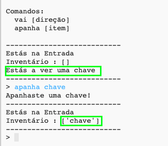

## Adicionar itens para apanhar

Vamos deixar itens nas divisões para o jogador apanhar enquanto se move pelo labirinto.

\--- task \---

Adding an item into a room is easy, you can just add it to a room's dictionary. Vamos colocar uma chave na entrada.

Lembra-te de colocar uma vírgula depois da linha acima do novo item, ou o teu programa nāo vai funcionar!

## \--- code \---

language: python

## line_highlights: 6-7

# um dicionário a ligar uma divisão a outras divisões

divisoes = {

            'Entrada' : {
                'sul' : 'Cozinha',
                'este' : 'Sala Jantar',
                'item' : 'chave'
            },
    
            'Cozinha' : {
                'norte' : 'Entrada'
            },
    
            'Sala Jantar' : {
                'oeste' : 'Entrada'
            }
    
        }
    

\--- /code \---

\--- /task \---

\--- task \---

If you run your game after adding the code above, you can now see a key in the hall, and you can even pick it up (by typing `get key`) which adds it to your inventory!

\--- /task \---