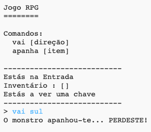

## Adicionar inimigos

Este jogo está demasiado fácil! Vamos adicionar a algumas das divisões inimigos que o jogador deve evitar.

\--- task \---

Adding an enemy to a room is as easy as adding any other item. Let’s add a hungry monster to the kitchen:

## \--- code \---

language: python

## line_highlights: 11-12

# um dicionário a ligar uma divisão a outras divisões

rooms = {

            'Entrada' : {
                'sul' : 'Cozinha',
                'este' : 'Sala Jantar',
                'item' : 'chave'
            },
    
            'Cozinha' : {
                'norte' : 'Entrada',
               'item' : 'monstro'
            },
    
            'Sala Jantar' : {
                'oeste' : 'Entrada'
            }
    
        }
    

\--- /code \---

\--- /task \---

\--- task \---

You also want to make sure that the game ends if the player enters a room with a monster in. You can do this with the following code, which you should add to the end of the game:

## \--- code \---

language: python

## line_highlights: 6-9

        #senāo, se nāo houver item para apanhar
        else:
            #diz ao jogador que nāo pode apanhar o item
            print('Nāo podes apanhar uma ' + jogada[1] + '!')
    
    #o jogador perde se entrar numa divisāo com um monstro
    if "item" in divisoes[divAtual] and 'monstro' in divisoes[divAtual]['item']:
        print('O monstro apanhou-te... PERDESTE!')
        break
    

\--- /code \---

This code checks whether there is an item in the room, and if so, whether that item is a monster. Notice that this code is indented, putting it in line with the code above it. This means that the game will check for a monster every time the player moves into a new room.

\--- /task \---

\--- task \---

Test out your code by going into the kitchen, which now contains a monster.

\--- /task \---