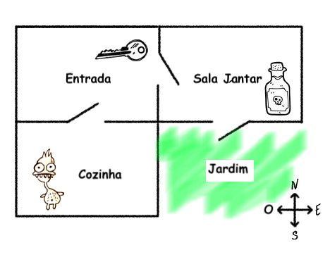
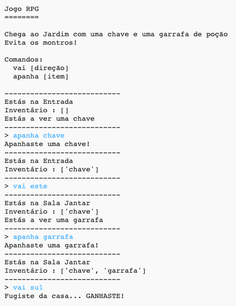
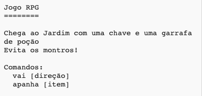

## Ganhar o jogo

Vamos dar ao teu jogador uma missão, que precisa ser concluída para ganhar o jogo.

\--- task \---

In this game, the player wins by getting to the garden and escaping the house. Também precisa de ter a chave e a garrafa de poçāo com ele. Aqui está um mapa do jogo.

\--- /task \---

\--- task \---

First, you need to add a garden to the south of the dining room. Lembra-te de adicionar portas, para ligar a outras divisões da casa.

## \--- code \---

language: python

## line_highlights: 16-17,18-22

# um dicionário a ligar uma divisāo a outras divisões

rooms = {

            'Entrada' : {
                'sul' : 'Cozinha',
                'este' : 'Sala Jantar',
                'item' : 'chave'
            },
    
            'Cozinha' : {
                'norte' : 'Entrada',
               'item' : 'monstro'
            },
    
            'Sala Jantar' : {
                'oeste' : 'Entrada',
                'sul' : 'Jardim"
            },
    
           'Jardim' : {
                'norte' : 'Sala Jantar'
           }
    
        }
    

\--- /code \---

\--- /task \---

\--- task \---

Add a potion to the dining room (or another room in your house).

## \--- code \---

language: python

## line_highlights: 3-4

            'Sala Jantar' : {
                'oeste' : 'Entrada',
                'sul' : 'Jardim",
                'item' : 'garrafa'
            },
    

\--- /code \---

\--- /task \---

\--- task \---

Add this code to allow the player to win the game when they get to the garden with the key and the potion:

## \--- code \---

language: python

## line_highlights: 6-9

# o jogador perde se entrar numa divisāo com um monstro

if 'item' in divisoes\[divAtual] and 'monstro' in divisoes[divAtual\]\['item'\]: print('O monstro apanhou-te... PERDESTE!') break

# o jogador ganha se entrar no jardim com a chave e a garrafa de poçāo

if divAtual == 'Jardim' and 'chave' in inventario and 'garrafa' in inventario: print('Fugiste da casa... YOU WIN!') break

\--- /code \---

Assegura-te de que este código está indentado, em linha com o código acima dele. Este código significa que a mensagem ` Escapaste da casa... Ganhaste!` é mostrada se o jogador está na divisāo 4 (o jardim) e se a chave e a garrafa de poçāo estiverem no inventário.

No código acima, se tiveres mais de quatro divisões, podes ter de usar um número diferente para o teu jardim.

\--- /task \---

\--- task \---

Test your game to make sure the player can win!

\--- /task \---

\--- task \---

Finally, let’s add some instructions to your game, so that the player knows what they have to do. Edita a funçāo `mostraInstrucoes()` para incluir mais informaçāo.

## \--- code \---

language: python

## line_highlights: 7-8

def mostraInstrucoes(): #imprime um menu principal e os comandos print('''

# Jogo RPG

Chega ao jardim com uma chave e uma garrafa de poçāo Evita os monstros!

Commands: go [direction] get [item] ''')

\--- /code \---

Vais precisar de instruções para dizer ao jogador quais os itens que precisa de apanhar, e quais precisa de evitar!

\--- /task \---

\--- task \---

Test your game and you should see your new instructions.

\--- /task \---