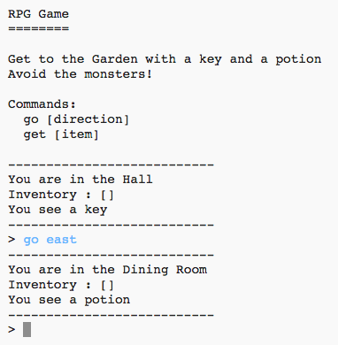

## Introducere:

În acest proiect, veți proiecta și implementa propriul joc RPG labirint. Scopul jocului este de a colecta obiecte și de a scăpa dintr-o casă, asigurându-vă că evitați toți monștrii!

  <iframe src="https://trinket.io/embed/python/d06adeb527?outputOnly=true&start=result" width="600" height="500" frameborder="0" marginwidth="0" marginheight="0" allowfullscreen>
  </iframe>
  

### Informații suplimentare pentru conducătorii de club

Dacă doriți să imprimați acest proiect, vă rugăm să folosiți [Versiunea pentru imprimare](https://projects.raspberrypi.org/en/projects/rpg/print).

## \--- collapse \---

## title: Notele liderului de club

## Introducere:

Acest proiect vă învață designul jocurilor prin implementarea unui joc de labirint RPG. În acest joc, jucătorul trebuie să colecteze obiecte dintr-o casă și să ajungă într-o anume cameră, evitând în același timp monștrii care se ascund în unele dintre camere. Acest joc va fi implementat prin manipularea dicționarelor și a listelor.

## Resurse online

**Acest proiect utilizează Python 3.** Vă recomandăm să utilizați [trinket](https://trinket.io/) pentru a scrie Python online. Proiectul conține următoarele Trinkets:

+ ['RPG' punct de pornire -- jumpto.cc/rpg-go](http://jumpto.cc/rpg-go)

Există, de asemenea, un trinket care conține proiectul finalizat:

+ [‘RPG’ Finalizat -- trinket.io/python/d06adeb527](https://trinket.io/python/d06adeb527)

## Resurse offline

Acest proiect poate fi [completat offline](https://www.codeclubprojects.org/en-GB/resources/python-working-offline/) dacă preferați. Puteți accesa resursele proiectului făcând clic pe linkul "Materiale de proiect" pentru acest proiect. Acest link conține o secțiune "Resurse de proiect", care include resursele de care copiii vor avea nevoie pentru a finaliza acest proiect offline. Asigurați-vă că fiecare copil are acces la o copie a acestor resurse. Această secțiune include următoarele fișiere:

+ rpg/rpg.py

De asemenea, puteți găsi proiectul finalizat în secțiunea "Resurse pentru voluntari", care conține:

+ rpg-finished/rpg.py

(Toate resursele de mai sus pot fi descărcate ca proiect sau fișiere `.zip` în secțiunea pentru voluntari.)

## Obiectivele exercitiului

+ Designul jocului;
+ Manipulare sau editare de: 
    + Liste;
    + Dicționare.
+ Expresii booleene (adevărat sau fals).

Acest proiect acoperă elemente din următoarele domenii ale [Raspberry Pi Digital Making Curriculum](http://rpf.io/curriculum):

+ [Combinați elemente de programare pentru a rezolva o problemă.](https://www.raspberrypi.org/curriculum/programming/builder)

## Provocări

+ Adăugarea de camere noi;
+ Adăugarea de elemente de colectat;
+ Adăugarea de dușmani de evitat;
+ Dezvoltarea propriilor jocuri.

## Întrebări frecvente

+ Este posibil ca copiii să aibă nevoie să li se reamintească faptul că elementele unui dicționar/listă sunt separate printr-o virgulă. De exemplu, când adăugați o cameră nouă în dicționarul "camere", trebuie adăugată o virgulă între camera nou adăugată și camera anterioară.
+ Când adaugă o cameră nouă, copiii pot uita să adauge o legătură între o încăpere existentă și camera nou creată. Asta însemna că copiii pot părăsi o cameră, dar nu pot intra în ea!
+ Codul pentru a testa dacă jucătorul a câștigat sau a pierdut jocul trebuie să fie indentat, pentru a se asigura că verificarea este efectuată la intrarea în fiecare cameră nouă. Dacă codul de verificare nu este indentat, acesta se află în afara buclei principale a jocului și nu este executat niciodată.

\--- /collapse \---

## \--- /collapse \---

## title: Materiale pentru proiect

## Resursele proiectului

+ [fişier .zip care conține toate resursele proiectului](resources/rpg-project-resources.zip)
+ [Trinket online care conține toate resursele proiectului "RPG"](http://jumpto.cc/rpg-go)
+ [rpg/rpg.py](resources/rpg-rpg.py)

## Resursele liderului de club

+ [fişier .zip care conține toate resursele proiectului completate](resources/rpg-volunteer-resources.zip)
+ [Trinket online proiect completat](https://trinket.io/python/d06adeb527)
+ [rpg-finished/rpg.py](resources/rpg-finished-rpg.py)

\--- /collapse \---