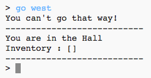

## Adăugarea de camere noi

\--- task \--- Deschide proiectul de bază Python.

**Online**: deschide proiectul de bază de la [rpf.io/rpgon](http://rpf.io/rpgon){:target="_blank"}.

**Offline**: deschide [proiectul de bază](http://rpf.io/p/en/rpg-go){:target="_blank"} în editorul offline. \--- /task \---

\--- task \--- Acesta este un joc RPG foarte simplu, care are numai 2 camere. Iată aici o hartă a jocului:

Poți tasta `misca sud` pentru a te mișca din hol înspre bucătărie și apoi `misca nord` pentru a reveni în hol!

 \--- /task \---

\--- task \--- Ce se intamplă când tastezi o direcție în care nu poți merge? Tastează `misca vest` în hol și vei primi un mesaj de eroare prietenos.

 \--- /task \---

\--- task \--- Dacă găsești variabila `camere`, poți vedea că harta este implementată ca un dicționar de camere:

## \--- code \---

## language: python

# un dicționar asociind o cameră cu alte camere

camere = {

            'Hol' : {
                'sud' : 'Bucatarie'
            },
    
            'Bucatarie' : {
                'nord' : 'Hol'
            }
    
        }
    

\--- /code \---

Fiecare cameră este un dicționar și camerele sunt legate una de alta folosind direcțiile.  
\--- /task \---

\--- task \--- Hai sa adăugam o sufragerie pe hartă, la est de hol.

Trebuie să adaugi o a treia cameră, numită `Sufragerie` și să o asociezi cu Hol (către vest). Va trebui de asemenea să adaugi date holului astfel încât să te poți mișca din sufragerie către est.

**Nu uita că va trebui să adaugi virgule liniilor aflate înainte de noul tău cod.**

## \--- code \---

language: python

## line_highlights: 5-6,11-15

# un dicționar asociind o camerî cu alte camere

camere = {

            'Hol' : {
                'sud' : 'Bucatarie',
                'est' : 'Sufragerie'
            },
    
            'Bucatarie' : {
                'nord' : 'Hol'
            },
    
            'Sufragerie' : {
                'vest' : 'Hol'
            }
    
        }
    

\--- /code \--- \--- /task \---

\--- task \--- Incearcă jocul cu noua ta sufragerie:

Dacă nu poți să te miști în sau din sufragerie, verifică dacă ai adăugat tot codul de mai sus (inclusiv noile virgule pe liniile de mai sus). \--- /task \---