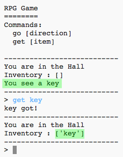

## Adăugarea de obiecte de colectat

Hai să lăsăm în camere obiecte de colectat pentru jucător pe măsură ce se mișcă prin labirint.

\--- task \---

Adding an item into a room is easy, you can just add it to a room's dictionary. Let’s put a key in the hall.

Remember to put a comma after the line above the new item, or your program won’t run!

## \--- code \---

language: python

## line_highlights: 6-7

# un dicționar asociind o cameră cu alte camere

rooms = {

            'Hol' : {
                'sud' : 'Bucatarie',
                'est' : 'Sufragerie',
                'item' : 'cheie'
            },
    
            'Bucatarie' : {
                'nord' : 'Hol'
            },
    
            'Sufragerie' : {
                'vest' : 'Hol'
            }
    
        }
    

\--- /code \---

\--- /task \---

\--- task \---

If you run your game after adding the code above, you can now see a key in the hall, and you can even pick it up (by typing `get key`) which adds it to your inventory!

\--- /task \---