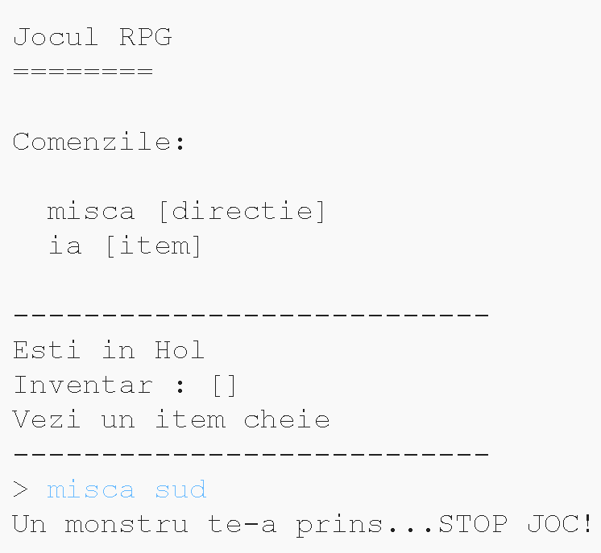

## Adăugarea oponenților

Acest joc este prea ușor! Hai să-i adăugăm dușmani pe care jucătorul trebuie să îi evite în câteva camere.

\--- task \--- Adăugarea unui dușman într-o cameră e la fel de simplă ca adăugarea unui item. Hai să adăugăm un monstru flămând în bucătărie:

## \--- code \---

language: python

## line_highlights: 11-12

# un dicționar asociind o cameră cu alte camere

camere = {

            'Hol' : {
                'sud' : 'Bucatarie',
                'est' : 'Sufragerie',
                'item' : 'cheie'
            },
    
            'Bucatarie' : {
                'nord' : 'Hol',
               'item' : 'monstru'
            },
    
            'Sufragerie' : {
                'vest' : 'Hol'
            }
    
        }
    

\--- /code \--- \--- /task \---

\--- task \--- Vrei de asemenea să te asiguri că jocul se termină dacă jucătorul intră într-o cameră cu un monstru inăuntru. Poți face asta cu următorul cod, pe care ar trebui să îl adaugi la sfârșitul jocului:

## \--- code \---

language: python

## line_highlights: 6-9

        #altfel, daca itemul nu este acolo si nu poate fi luat
        else:
          #spune-i ca nu il poate lua
          print('Nu poti lua ' + miscare[1] + '!')
    
    #jucatorul pierde daca intra intr-o camera cu un monstru
    if 'item' in camere[cameraCurenta] and 'monstru' in camere[cameraCurenta]['item']:
        print('Un monstru te-a prins... STOP JOC!')
        break
    

\--- /code \---

Acest cod verifică dacă există un item în cameră, și dacă da, dacă acel item este un monstru. De remarcat că acest cod este indentat, pentru a se potrivi cu codul de deasupra lui. Aceasta înseamnă că jocul va testa existența monstrului de fiecare dată când jucătorul se mută într-o cameră nouă. \--- /task \---

\--- task \--- Testează-ți codul ducându-te în bucătărie, care conține acuma un monstru.

 \--- /task \---