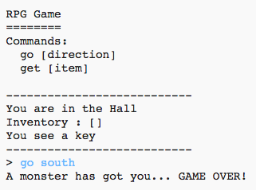

## Adăugarea oponenților

Acest joc este prea ușor! Hai să-i adăugăm dușmani pe care jucătorul trebuie să îi evite în câteva camere.

\--- task \---

Adding an enemy to a room is as easy as adding any other item. Let’s add a hungry monster to the kitchen:

## \--- code \---

language: python

## line_highlights: 11-12

# un dicționar asociind o cameră cu alte camere

rooms = {

            'Hol' : {
                'sud' : 'Bucatarie',
                'est' : 'Sufragerie',
                'item' : 'cheie'
            },
    
            'Bucatarie' : {
                'nord' : 'Hol',
               'item' : 'monstru'
            },
    
            'Sufragerie' : {
                'vest' : 'Hol'
            }
    
        }
    

\--- /code \---

\--- /task \---

\--- task \---

You also want to make sure that the game ends if the player enters a room with a monster in. You can do this with the following code, which you should add to the end of the game:

## \--- code \---

language: python

## line_highlights: 6-9

        #altfel, daca itemul nu este acolo si nu poate fi luat
        else:
          #spune-i ca nu il poate lua
          print('Nu poti lua ' + miscare[1] + '!')
    
    #jucatorul pierde daca intra intr-o camera cu un monstru
    if 'item' in camere[cameraCurenta] and 'monstru' in camere[cameraCurenta]['item']:
        print('Un monstru te-a prins... STOP JOC!')
        break
    

\--- /code \---

This code checks whether there is an item in the room, and if so, whether that item is a monster. Notice that this code is indented, putting it in line with the code above it. This means that the game will check for a monster every time the player moves into a new room.

\--- /task \---

\--- task \---

Test out your code by going into the kitchen, which now contains a monster.

\--- /task \---