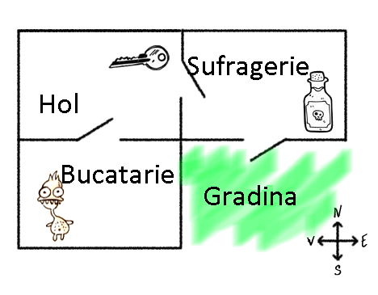
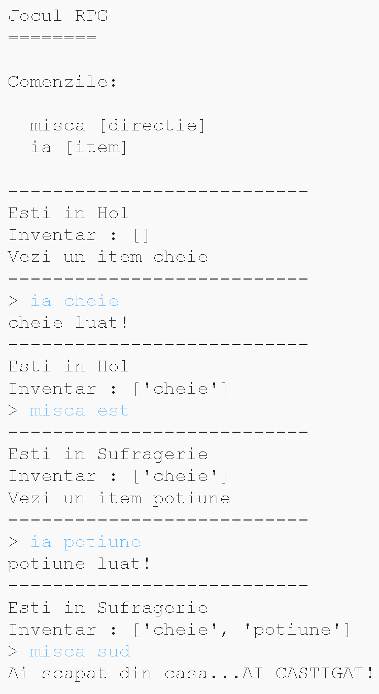
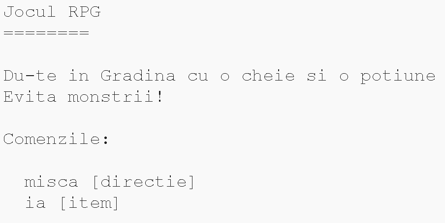

## Cum să câștigi jocul

Hai să-i dăm jucătorului o misiune pe care va trebui să o îndeplinească pentru a câștiga jocul.

\--- task \--- În acest joc, jucătorul câștigă ajungând în grădină și scăpând din casă. Va avea de asemenea nevoie să aibă cheia și poțiunea magică la el. Iată o hartă a jocului.

 \--- /task \---

\--- task \--- Mai întâi, va trebui să adaugi o grădină la sud de sufragerie. Amintește-ți să adaugi uși pentru a lega alte camere din casă.

## \--- code \---

language: python

## line_highlights: 16-17,18-22

# un dicționar asociind o cameră cu alte camere

camere = {

            'Hol' : {
                'sud' : 'Bucatarie',
                'est' : 'Sufragerie',
                'item' : 'cheie'
            },
    
            'Bucatarie' : {
                'nord' : 'Hol',
               'item' : 'monstru'
            },
    
            'Sufragerie' : {
                'vest' : 'Hol',
                'sud' : 'Gradina'
            },
            'Gradina' : {
                'nord' : 'Sufragerie'
            }
    
    
        }
    

\--- /code \--- \--- /task \---

\--- task \--- Adaugă o poțiune în sufragerie (sau în altă cameră din casă).

## \--- code \---

language: python

## line_highlights: 3-4

            'Sufragerie' : {
                'vest' : 'Hol',
                'sud' : 'Gradina',
                'item' : 'potiune'
            },
    

\--- /code \--- \--- /task \---

\--- task \--- Adaugă acest cod pentru a-i permite jucătorului să caștige când se duce în gradină cu cheia și poțiunea:

## \--- code \---

language: python

## line_highlights: 6-9

# jucătorul pierde dacă intră într-o cameră cu un monstru

if 'item' in camere\[cameraCurenta] and 'monstru' in camere[cameraCurenta\] \['item'\]: print('Un monstru te-a prins... STOP JOC!') break

# jucătorul câștigă dacă ajunge în grădină cu cheia si poțiunea

if cameraCurenta== 'Gradina' and 'cheie' in inventar and 'potiune' in inventar: print('Ai scapat din casa... AI CASTIGAT!') break \--- /code \---

Asigură-te că acest cod este indentat, asemenea codului de deasupra sa. Acest cod înseamnă că mesajul `Ai scapat din casa...AI CASTIGAT!` este afișat dacă jucătorul este în camera 4 (grădină) și dacă cheia și poțiunea sunt în inventar.

Dacă ai peste 4 camere, s-ar putea să ai nevoie sa folosești un alt număr pentru grădina ta în codul de mai sus. \--- /task \---

\--- task \--- Testează-ți jocul pentru a te asigura că jucătorul poate câștiga!

 \--- /task \---

\--- task \--- In sfârșit, hai să-i adaugăm niște instrucțiuni jocului astfel incât jucătorul să știe ce are de facut. Editează funcția `afiseazaInstructiuni()` pentru a include mai multe informații.

## \--- code \---

language: python

## line_highlights: 7-8

def afiseazaInstructiuni(): #afiseaza meniul principal si comenzile print('''

# Jocul RPG

Du-te în grădină cu o cheie si o poțiune Evită monștrii!

Comenzi: misca [directie] ia [item] ''') \--- /code \---

Va trebui să adaugi instrucțiuni ca să-i spui utilizatorului ce obiecte trebuie să colecteze și de care să se ferească! \--- /task \---

\--- task \--- Testează-ți jocul și ar trebui să vezi noile instrucțiuni.

 \--- /task \---