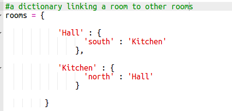

## Добавление новых комнат

+ Для вас определен код для этой игры. Откройте эту побрякушку: <a href="http://jumpto.cc/rpg-go" target="_blank">jumpto.cc/rpg-go</a>.

+ Это очень простая RPG игра, в которой есть только 2 комнаты. Вот карта игры:
    
    
    
    Вы можете ввести `идите на юг` чтобы переместиться из зала на кухню, а затем `идите на север` чтобы снова вернуться в зал!
    
    

+ Что происходит, когда вы вводите направление, в которое вы не можете пойти? Тип `идет на запад` в зале, и вы получите приветственное сообщение об ошибке.
    
    

+ Если вы найдете переменную `номеров` , вы увидите, что карта кодируется как словарь номеров:
    
    
    
    В каждом номере есть словарь, а номера связаны друг с другом с помощью инструкций.

+ Давайте добавим столовую на вашу карту, к востоку от зала.
    
    
    
    Вам нужно добавить 3-ю комнату, названную `столовой`. Вам также нужно связать его с залом на запад. Вам также нужно добавить данные в зал, чтобы вы могли перейти в столовую на восток.
    
    

+ Попробуйте игру в новой столовой:
    
    
    
    Если вы не можете перемещаться в столовой и выходить из нее, просто проверьте, что вы добавили весь код выше (включая дополнительные запятые к строкам выше).