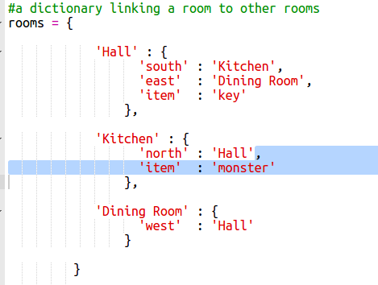

## Добавление врагов

Эта игра слишком проста! Давайте добавим врагов в некоторые комнаты, которые игрок должен избегать.

+ Добавление противника в комнату так же просто, как добавление любого другого элемента. Давайте добавим голодного монстра на кухню:
    
    

+ Вы также хотите убедиться, что игра заканчивается, если игрок входит в комнату с монстром. Вы можете сделать это со следующим кодом, который вы должны добавить к концу игры:
    
    
    
    Этот код проверяет, есть ли предмет в комнате, и если да, то является ли этот элемент монстром. Обратите внимание, что этот код имеет отступ, помещая его в соответствие с кодом выше. Это означает, что игра проверяет монстра каждый раз, когда игрок переходит в новую комнату.

+ Проверьте свой код, войдя на кухню, в которой теперь находится монстр.
    
    