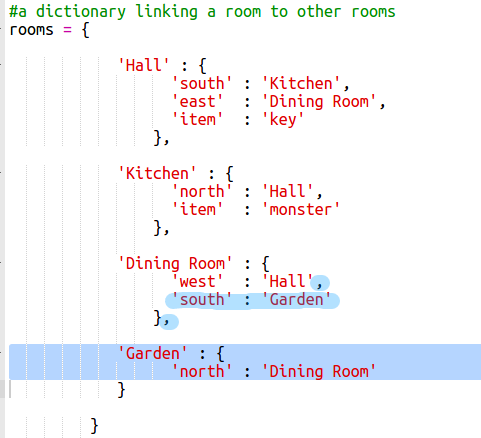
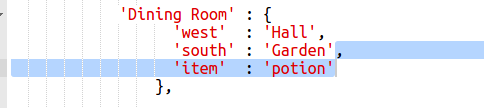
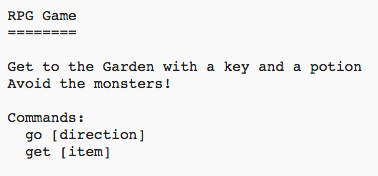

## Победа в игре

Давайте дадим вашему игроку миссию, которую нужно завершить, чтобы выиграть игру.

+ В этой игре игрок выигрывает, садясь в сад и убегая из дома. Им также нужно иметь ключ с ними и волшебное зелье. Вот карта игры.
    
    

+ Во-первых, вам нужно добавить сад к югу от столовой. Не забудьте добавить двери, чтобы связаться с другими комнатами в доме.
    
    

+ Добавьте зелье в столовую (или другую комнату в вашем доме).
    
    

+ Добавьте этот код, чтобы позволить игроку выиграть игру, когда они доберутся до сада с ключом и зельем:
    
    
    
    Убедитесь, что этот код имеет отступы, в соответствии с приведенным выше кодом. Этот код означает, что сообщение `Вы сбежали из дома ... ВЫ ВЫИГРАЛИ!` отображается, если игрок находится в комнате 4 (сад), и если ключ и зелье находятся в инвентаре.
    
    Если у вас более 4 комнат, вам, возможно, придется использовать другой номер номера для вашего сада в приведенном выше коде.

+ Проверьте свою игру, чтобы игрок смог победить!
    
    

+ Наконец, давайте добавим некоторые инструкции в вашу игру, чтобы игрок знал, что им нужно делать. Измените функцию `showInstructions ()` чтобы включить дополнительную информацию.
    
    
    
    Вам нужно будет добавить инструкции, чтобы рассказать пользователю, какие предметы им нужно собрать, и чего им нужно избегать!

+ Проверьте свою игру, и вы увидите новые инструкции.
    
    