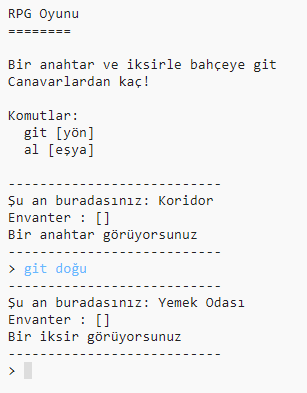

## Giriş:

Bu projede, kendi RPG labirent oyununu tasarlayıp kodlayacaksın. Oyunun amacı canavarlara yakalanmadan nesneleri toplayıp evden kaçmak olacak!

## Ne yapacaksınız

\--- no-print \---

Dünyada gezinmek için `git` ve yanına bir yön yazın (kuzey, doğu, güney ya da batı) (ör: `git kuzey`).

Gördüğünüz eşyaları toplamak için `al` yazın. (ör: `al anahtar`).

  <iframe src="https://trinket.io/embed/python/d06adeb527?outputOnly=true&start=result" width="600" height="500" frameborder="0" marginwidth="0" marginheight="0" allowfullscreen>
  </iframe>
  

\--- /no-print \---

\--- print-only \---

\--- /print-only \---

## \--- collapse \---

## title: Nelere ihtiyacınız var

### Donanım

+ Python çalıştırabilen bir bilgisayar

### Yazılım

+ Python 3 (ya [çevrimiçi](https://trinket.io/){:target="_blank"} ya da [çevrimdışı](https://www.python.org/downloads/){:target="_blank"})

### İndirilenler

Başlangıç projesini [burada](http://rpf.io/p/en/rpg-go){:target="_blank"} bulabilirsiniz.

\--- /collapse \---

## \--- collapse \---

## title: Ne öğreneceksiniz

+ Oyun tasarım;
+ Düzenleme: 
    + Listeler;
    + Sözlükler.
+ Boolean ifadeleri.

Bu proje, [Raspberry Pi Digital Making Curriculum](http://rpf.io/curriculum) 'un aşağıdaki bölümlerinden unsurları kapsamaktadır:

+ [Bir problemi çözmek için programlama yapılarını birleştirme.](https://www.raspberrypi.org/curriculum/programming/builder)

\--- /collapse \---

## \--- collapse \---

## title: Eğitimciler için ek bilgiler

Bu projeyi yazdırmanız gerekiyorsa, lütfen [Yazıcı dostu sürüm](https://projects.raspberrypi.org/en/projects/rpg/print)ü kullanın.

[Bu proje için çözümlere şuradan{:target="_blank"} ulaşabilirsiniz.](http://rpf.io/p/en/rpg-get).

\--- /collapse \---