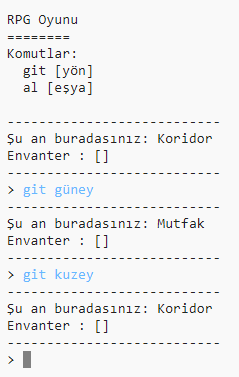

## Yeni oda ekleme

--- task ---

Python başlangıç projesini açın.

**Çevrimiçi**: başlangıç projesini [trinket.io/python/dcf6dace3e](https://trinket.io/python/dcf6dace3e){:target="_blank"} linkinden açın.

**Çevrimdışı**: [başlangıç projesini](http://rpf.io/p/tr-TR/rpg-go){:target="_blank"} Çevrimdışı düzenleyicide açın.

--- /task ---

--- task ---

Bu sadece 2 odası olan çok basit RPG oyunu. Burada oyunun bir haritası var:

Koridordan mutfağa gitmek için `git güney` yazabilir ve geri dönmek için `git kuzey` yazabilirsin!

--- /task ---

--- task ---

Gidemeyeceğin bir yön yazarsan ne olur? Koridordayken `git batı` yazınca dostça bir hata mesajıyla karşılaşacaksın.

--- /task ---

--- task ---

Eğer `odalar` değişkenini bulursan, haritanın, odalar sözlüğü olarak kodlandığını göreceksin:

--- code ---
---
language: python
---
# bir odayı başka odalara bağlayan bir sözlük
odalar = {

            'Koridor' : {
                'güney' : 'Mutfak'
            },
    
            'Mutfak' : {
                'kuzey' : 'Oturma Odası'
            }
    
        }
    

--- /code ---

Her oda bir sözlüktür ve odalar yönleri kullanarak birbirine bağlıdır.

--- /task ---

--- task ---

Haritaya bir oturma odası ekleyelim, koridorun doğusunda olsun.

Üçüncü bir oda eklemen gerek, `oturma odası`, ve onu koridora bağla (batısına). Aynı zamanda koridora da veri eklemen gerekiyor, böylece doğudan oturma odasına gidebilirsin.

**Yeni kod eklemeden önce satırlara virgülleri de eklemen gerektiğini unutma.**

--- code ---
---
language: python
line_highlights: 5-6,11-15
---
# bir odayı başka odalara bağlayan bir sözlük
odalar = {

            'Koridor' : {
                'güney' : 'Mutfak',
                'doğu' : 'Oturma Odası'
            },
    
            'Mutfak' : {
                'kuzey' : 'Koridor'
            },
    
            'Oturma Odası' : {
                'batı' : 'Koridor'
            }
    
        }
    

--- /code ---

--- /task ---

--- task ---

Oyunu yeni oturma odanla beraber dene:

Oturma odasına giriş çıkış yapamıyorsan, yukarıda eklediğin kodu bir kontrol et (satırlarda fazladan eklenen virgülleri de içeren).

--- /task ---