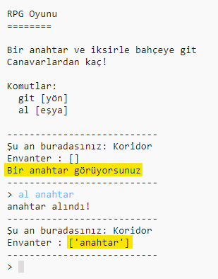

## Toplamak için eşyalar ekleme

Hadi, odalara oyuncuların labirentte ilerledikçe toplayacakları eşyalar bırakalım.

--- task ---

Bir odaya eşya eklemek kolay; tek yapacağın şey, odanın sözlüğüne eklemek. Hadi koridora bir anahtar koyalım.

Yeni eşyanın üstündeki satırın sonuna virgül eklemeyi unutma, yoksa programın çalışmaz!

--- code ---
---
language: python
line_highlights: 6-7
---
# bir odayı başka odalara bağlayan bir sözlük

odalar = {

            'Koridor' : {
                'güney' : 'Mutfak',
                'doğu' : 'Yemek Odası',
                'eşya' : 'anahtar'
            },
    
            'Mutfak' : {
                'kuzey' : 'Koridor'
            },
    
            'Yemek Odası' : {
                'batı' : 'Koridor'
            }
    
        }
    

--- /code ---

--- /task ---

--- task ---

Yukarıdaki kodu ekledikten sonra oyunu başlatırsan, koridorda bir anahtar görebilirsin ve hatta envanterine alabilirsin (`al anahtar` yazarak)!

--- /task ---