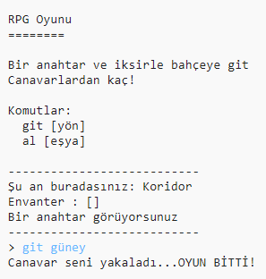

## Düşman ekleme

Bu oyun çok kolay! Hadi bazı odalara oyuncunun kaçması gereken düşmanlar ekleyelim.

\--- task \---

Odaya düşman koymak, başka bir eşya koymak kadar kolay. Hadi mutfağa aç bir canavar koyalım:

## \--- code \---

language: python

## line_highlights: 11-12

# bir odayı başka odalara bağlayan bir sözlük

odalar = {

            'Koridor' : {
                'güney' : 'Mutfak',
                'doğu' : 'Yemek Odası',
                'eşya' : 'anahtar'
            },
    
            'Mutfak' : {
                'kuzey' : 'Koridor',
                'eşya' : 'canavar'
            },
    
            'Yemek Odası' : {
                'batı' : 'Koridor'
            }
    
        }
    

\--- /code \---

\--- /task \---

\--- task \---

Oyuncunun içinde canavar olan bir odaya girdiğinde oyunun biteceğinden emin olmak isteyeceksin. Aşağıda oyunun sonuna eklemen gereken kodla bunu yapabilirsin:

## \--- code \---

language: python

## line_highlights: 6-9

        #aksi halde, alacak eşya yoksa
        else:
            #onlara alamayacaklarını söyle
            print('Şunu alamazsın: ' + move[1] + '!')
    
    #oyuncu canavarlı bir odaya girdiğinde kaybeder
    if 'eşya' in odalar[suankiOda] and 'canavar' in odalar[suankiOda]['eşya']:
        print('Bir canavar seni yakaladı... KAYBETTİN!')
        break
    

\--- /code \---

Bu kod odada bir eşya olup olmadığını kontrol eder, varsa, onun canavar olup olmadığına bakar. Kodun girintili yazıldığına dikkat et, yukarıdaki kodun olduğu satıra koyulur. Bu, oyuncunun her oda değiştirdiğinde, oyunun canavar olup olmadığını kontrol edeceği anlamına gelir.

\--- /task \---

\--- task \---

Mutfağa giderek kodunu kontrol et, şimdi orada bir canavar var.

\--- /task \---