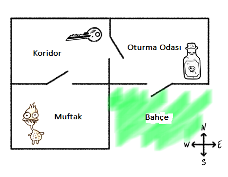
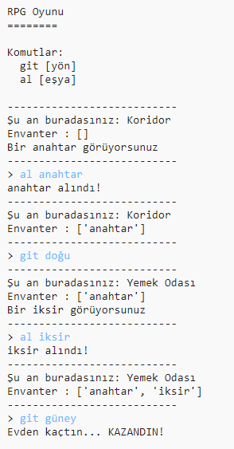
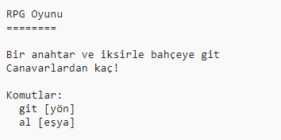

## Oyunu kazanma

Oyuncuya bir görev ver, oyunu kazanması için tamamlaması gerekir.

--- task ---

Bu oyunda, oyuncu evden kaçıp bahçeye ulaşarak oyunu kazanır. Ayrıca anahtar ve sihirli iksire ihtiyaçları olacak. Burada oyunun bir haritası var.

--- /task ---

--- task ---

Öncelikle, yemek odasının güneyine bir bahçe eklemen gerek. Evdeki odaları bağlamak için kapı eklemeyi unutma.

--- code ---
---
language: python
line_highlights: 16-17,18-22
---
# bir odayı başka odalara bağlayan bir sözlük

odalar = {

            'Koridor' : {
                'güney' : 'Mutfak',
                'doğu' : 'Yemek Odası',
                'eşya' : 'anahtar'
            },
    
            'Mutfak' : {
                'kuzey' : 'Koridor',
                'eşya' : 'canavar'
            },
    
            'Yemek Odası' : {
                'batı' : 'Koridor',
                'güney' : 'Bahçe'
            },
    
            'Bahçe' : {
                 'kuzey' : 'Yemek Odası'
            }
    
        }
    

--- /code ---

--- /task ---

--- task ---

Oturma odasına bir iksir ekle (veya başka bir odaya).

--- code ---
---
language: python
line_highlights: 3-4
---
            'Yemek Odası' : {
                'batı' : 'Koridor',
                'güney' : 'Bahçe',
                'eşya' : 'iksir'
            },
    

--- /code ---

--- /task ---

--- task ---

Bu kodu ekleyerek, oyuncunun anahtarı ve iksiri alıp bahçeye gelerek kazanmasına izin ver:

--- code ---
---
language: python
line_highlights: 6-9
---
# oyuncu canavar olan bir odaya girerse kaybeder

if 'eşya' in odalar [suankiOda] and 'canavar' in odalar[suankiOda\]['eşya']: 
    print('Bir canavar seni yakaladı... KAYBETTİN!') 
    break

# oyuncu bahçeye bir anahtar ve iksirle ulaşırsa kazanır

if suankiOda == 'Bahçe' and 'anahtar' in envanter and 'iksir' in envanter: 
    print('Evden kaçtın... KAZANDIN!') 
    break

--- /code ---

Kodun yukarıdaki kodla aynı şekilde girintili olduğundan emin ol. Bu kod `Evden kaçtın...KAZANDIN!` mesajının görüntülendiğini gösterir, eğer oyuncu oda 4'te ise (bahçedeyse) ve envanterinde anahtar ve iksir varsa.

Eğer 4'ten fazla odan varsa, yukarıdaki kodda bahçe için farklı bir sayı kullanman gerekebilir.

--- /task ---

--- task ---

Oyuncunun kazanabildiğinden emin olmak için oyunu test et!

--- /task ---

--- task ---

Son olarak, oyuna birkaç talimat ekleyelim. Böylece oyuncu ne yapması gerektiğini bilir. `talimatlariGoster()` fonksiyonunu düzenleyerek daha fazla bilgi verebilirsin.

--- code ---
---
language: python
line_highlights: 7-8
---
def talimatlariGoster(): 
    #ana menü ve komutları ekrana yazdır 
    print('''
RPG Oyunu
========

Bir anahtar ve iksirle bahçeye git 
Canavarlardan saklan!

Komutlar: 
git [yön] 
al [eşya] 
''')

--- /code ---

Oyuncunun ne toplaması gerektiğini ve neyden saklanması gerektiğini söylemek için talimatlara ihtiyacın olacak!

--- /task ---

--- task ---

Oyunu test et ve yeni talimatlarını gör.

--- /task ---