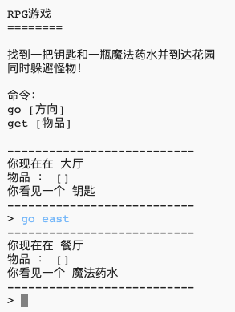

## 介绍：

在本项目中，你将设计并编写你自己的RPG（角色扮演游戏）迷宫游戏。 这个游戏的目标是收集物品并逃离房子，同时还要确保避开所有的怪物。

## 你将制作：

\--- no-print \---

输入`go`然后输入一个方向(north,east,south或west)围绕世界移动(例如`go norht`).

输入`get`拿到你看到的物品(例如`get key`).

  <iframe src="https://trinket.io/embed/python/d06adeb527?outputOnly=true&start=result" width="600" height="500" frameborder="0" marginwidth="0" marginheight="0" allowfullscreen>
  </iframe>
  

\--- /no-print \---

\--- print-only \---

\--- /print-only \---

## \--- collapse \---

## title: 你需要准备什么

### 硬件

+ 能够运行Python的电脑

### 软件

+ Python 3（[在线版本](https://trinket.io/){:target="_blank"}或[离线版本](https://www.python.org/downloads/){:target="_blank"}）

### 下载

初始项目在[这里](http://rpf.io/p/en/rpg-go){:target="_blank"}.

\--- /collapse \---

## \--- collapse \---

## title: 你将学到什么

+ 游戏设计;
+ 编辑： 
    + 列表；
    + 字典
+ 布尔表达式。

本项目涵盖[树莓派数字制作课程](http://rpf.io/curriculum)如下几方面内容：

+ [综合利用编程结构解决问题。](https://www.raspberrypi.org/curriculum/programming/builder)

\--- /collapse \---

## \--- collapse \---

## title: 教师附加信息

如果您需要打印此项目，请使用[适合打印版本](https://projects.raspberrypi.org/en/projects/rpg/print) 。

你可以 [在这里找到已完成的项目](http://rpf.io/p/en/rpg-get){:target="_blank"}

\--- /collapse \---