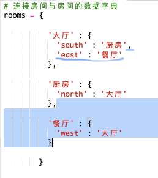

## 添加新房间

+ 已为你提供了此游戏的某些代码。打开这个 trinket：<a href="http://jumpto.cc/rpg-go" target="_blank">jumpto.cc/rpg-go</a>。 

+ 这是一个非常基本的 RPG 游戏，仅有 2 个房间。以下是游戏的地图：

  

  你可以输入 `go south` 从客厅移向厨房，然后输入 `go north` 再次返回客厅！

  

+ 当你输入了一个你无法到达的方向时会发生什么？在客厅中输入 `go west`，你会收到一条友好的错误消息。

  

+ 如果你找到 `rooms` 变量，你会看到地图被编码为房间的字典：

  

  每个房间都是一个字典，多个房间使用方向连接在一起。  
  

+ 让我们向你的地图添加一个餐厅，位于客厅的东部。

  

  你需要添加第 3 个房间，名为 `dining room`。你还需要将其与西边的客厅连接起来。你还需要向客厅添加数据，以便你能向东移动到餐厅。
  
  

+ 试试带有新餐厅的游戏：

  

  如果你无法进出餐厅，只需检查你是否添加了上文的全部代码（包括上方行末附加的逗号）。

