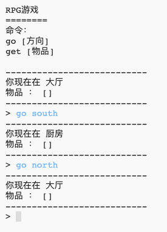
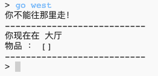
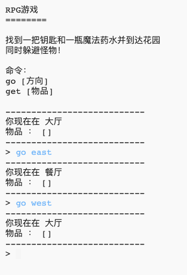

## 添加新房间

--- task --- 打开Python初始项目.

**在线：** 在 [trinket.io/python/51d8aeeed8](https://trinket.io/python/51d8aeeed8){:target="_blank"}打开初始项目。

在离线编辑器中**离线**: 打开 [初始项目](http://rpf.io/p/zh-CN/rpg-go){:target="_blank"}. --- /task---

--- task ---

这是个仅包含2个房间的基本的RPG游戏。 以下是游戏的地图：

你可以输入`go south`指令从大厅走到厨房，然后输入`go north`指令再返回大厅！

 --- /task---

--- task ---

当你输入一个无法到达的方向时将会发生什么？ 当你在大厅时，输入`go west`指令，你将得到一个友善的错误消息。

 --- /task---

--- task ---

当你在代码中找到`rooms`变量时，你会发现游戏地图实际上是用一个包含房间信息的数据字典来实现的。

--- code ---
---
language: python
---
# 连接房间与房间的数据字典

rooms = {

            'Hall' : {
                'south' : 'Kitchen'
            },
    
            'Kitchen' : {
                'north' : 'Hall'
            }
    
        }
    

--- /code ---

每个房间是字典中的一项数据，然后用方向来将房间与房间关联起来。 --- /task ---

--- task --- 让我们在地图上添加一个餐厅，将其放在大厅的东面。

你需要添加第三个房间, 叫做 `餐厅`, 把它和大厅连接起来 (在西面). 你还需要向大厅添加数据，以使你可以从那里向东走到餐厅。

**不要忘记, 你需要在新代码前添加逗号.**

--- code ---
---
language: python
---
## line_highlights: 5-6,11-15

# 连接房间与房间的数据字典

rooms = {

            'Hall' : {
                'south' : 'Kitchen',
                'east' : 'Dining Room'
            },
    
            'Kitchen' : {
                'north' : 'Hall'
            },
    
            'Dining Room' : {
                'west' : 'Hall'
            }
    
        }
    

--- /code --- --- /task ---

--- task --- 加完新的餐厅后，试着运行一下游戏。

如果你不能走进或走出餐厅，检查你是否已经添加了如上所示的所有代码（包括在上一行已有代码行末尾添加额外的逗号）。 --- /task ---
