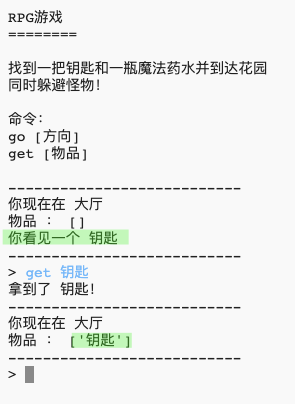

## 添加可收集的物品

让我们在房间中添置一些物品，让玩家在穿越迷宫的时候收集。

--- task ---

在房间中添加一个物品很简单，你只需要交其添加到该房间的数据字典中即可。 让我们在大厅中添加一把钥匙。

在添加新一行时记住要在前一行的末尾添加一个逗号，否则你的程序将不能运行！

--- code ---
---
language: python
line_highlights: 6-7
---
#连接房间与房间的数据字典
rooms = {

            '大厅' : {
                'south' : '厨房',
                'east' : '餐厅',
                'item' : '钥匙'
            },
    
            '厨房' : {
                'north' : '大厅'
            },
    
            '餐厅' : {
                'west' : '大厅'
            }
    
        }
    

--- /code ---

--- /task ---

--- task ---

在添加好上述代码之后，当你再次运行你的游戏时，你可以在大厅中看到一把钥匙，并且可以拾起它（通过输入`get key`指令）并将其加入你的物品袋中。

--- /task ---