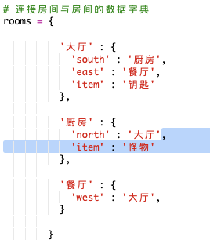
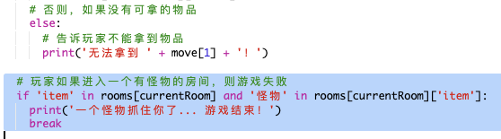
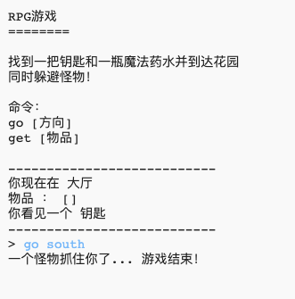

## 添加敌人

这个游戏太简单了！让我们向一些房间添加玩家必须躲避的敌人。

+ 向房间添加敌人和添加任何其他物品一样简单。让我们向厨房添加一只饥饿的怪物：

  

+ 你还想要确保游戏在玩家进入其中有怪物的房间时终止。你可以使用以下代码来做到这一点，你应将这些代码添加到游戏的末尾：

  

  此代码会检查房间中是否有物品，如果有，则检查该物品是否为怪物。请注意此代码被缩进，将其与上文的代码对齐。这意味着游戏会在玩家每次进入一个新房间时检查是否有怪物。

+ 现在厨房中有怪物，进入厨房来测试你的代码。

  

