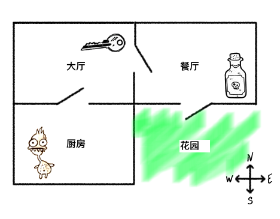
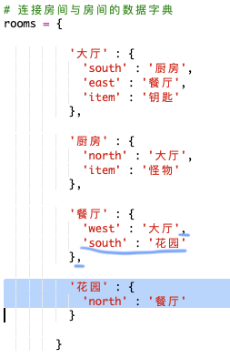
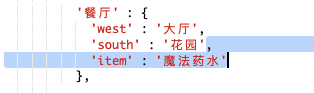
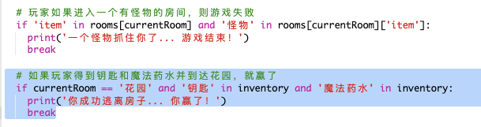
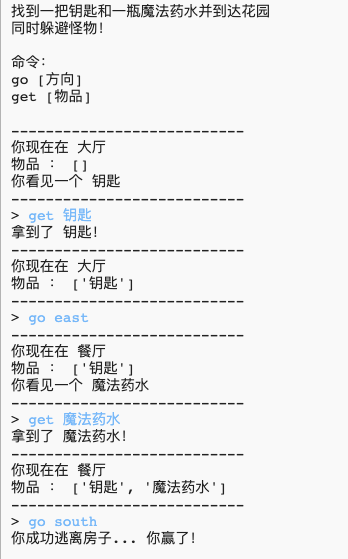
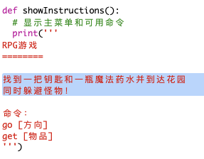
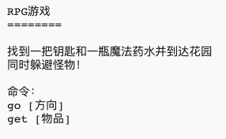

## 赢得胜利

让我们赋予玩家一项任务，玩家需要完成该任务来赢得游戏胜利。

+ 在此游戏中，玩家通过到达花园和逃离房子来取得胜利。他们还需要携带钥匙和魔法药水。以下是游戏的地图。

  

+ 首先，你需要在餐厅的南部添加一个花园。请记得添加房门，来连接房子内的其他房间。
  
  

+ 向餐厅（或房子内的另一个房间）添加一瓶药水。

  
  
+ 添加此代码来让玩家在携带钥匙和药水到达花园时赢得游戏胜利：

  

  请确保此代码被缩进，与上文的代码对齐。此代码意味着如果玩家位于房间 4（花园）且库存中有钥匙和药水，则播放 `You escaped the house...YOU WIN!`（你逃离了房子...你赢了！）这条信息。​
  
  如果你有 4 个以上房间，你可能需要在上文代码中对花园使用不同的房间编号。

+ 测试你的游戏来确保玩家能赢！

  

+ 最后，让我们向你的游戏添加一些说明，使得玩家知道他们必须做什么。编辑 `showInstructions()` 函数来添加更多信息。

  

  你将需要添加说明来告诉用户他们需要收集哪些物品，以及他们需要避开什么！

+ 测试你的游戏，你会看到你的新说明。
  
  

