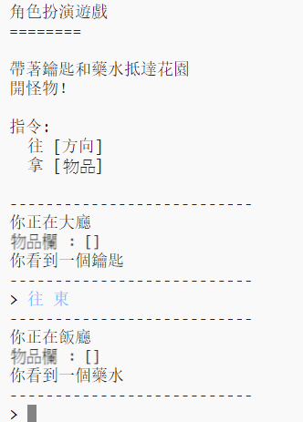

## 介紹：

在這個專案中，你將編寫和設計自己的迷宮冒險遊戲程式。 遊戲目標是收集物品、避開所有的怪物並成功逃離房屋！

## 你將會做出

\--- no-print \---

輸入`往`加上要移動的方位(東，南，西或北)，例如：`往 北`。

輸入`拿`拾取你看到的物品，例如：`拿 鑰匙`。

  <iframe src="https://trinket.io/embed/python/d06adeb527?outputOnly=true&start=result" width="600" height="500" frameborder="0" marginwidth="0" marginheight="0" allowfullscreen>
  </iframe>
  

\--- /no-print \---

\--- print-only \---

\--- /print-only \---

## \--- collapse \---

## title: 你會用到

### 硬體

+ 可運行Python的電腦

### 軟體

+ Python 3 ([線上版本](https://trinket.io/){:target="_blank"} 或 [離線版本](https://www.python.org/downloads/){:target="_blank"})

### 下載

The starter project can be found [here](https://rpf.io/p/en/rpg-go){:target="_blank"}.

\--- /collapse \---

## \--- collapse \---

## title: 你會學到

+ 遊戲設計
+ 編輯： 
    + 列表;
    + 字典。
+ 布林運算式

This project covers elements from the following strands of the [Raspberry Pi Digital Making Curriculum](https://rpf.io/curriculum):

+ [結合程式設計結構來解決問題。](https://www.raspberrypi.org/curriculum/programming/builder)

\--- /collapse \---

## \--- collapse \---

## title: 給教師的其它資訊

如果你需要列印這個專案，可以先切換成[列印友好模式](https://projects.raspberrypi.org/en/projects/rpg/print)。

You can [find the solution for this project here](https://rpf.io/p/en/rpg-get){:target="_blank"}.

\--- /collapse \---