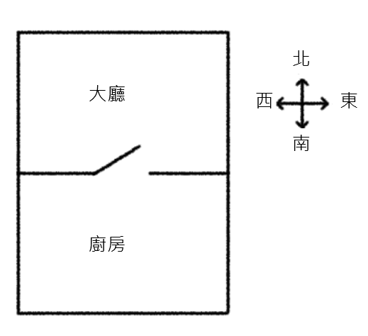
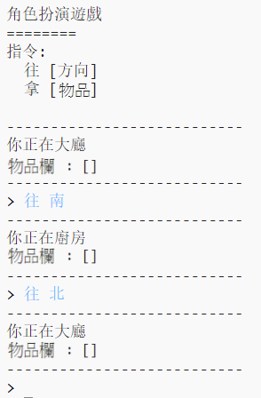
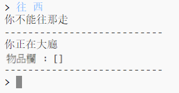
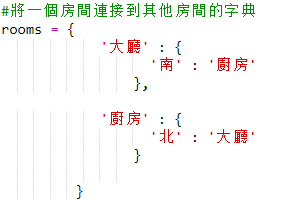
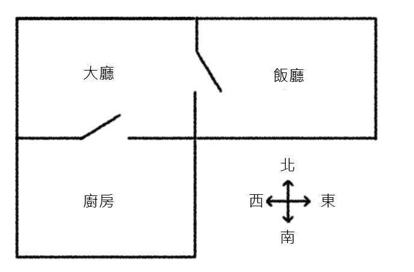
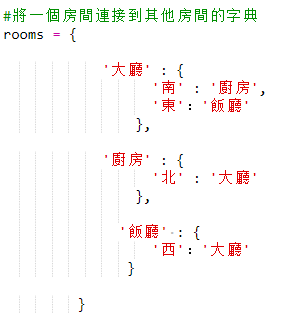
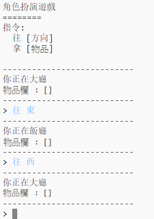

## 添加新房間

+ 已經為您提供了此遊戲的一些代碼。 打開這個小飾品： <a href="http://jumpto.cc/rpg-go" target="_blank">jumpto.cc/rpg-go</a>。

+ 這是一款非常基本的RPG遊戲，只有2個房間。 這是遊戲地圖：
    
    
    
    你可以輸入 `向南` 從大廳移動到廚房，然後 `向北` 再次回到大廳！
    
    

+ 當你輸入一個你不能去的方向時會發生什麼？ 鍵入 `在大廳的西` ，你會得到一個友好的錯誤信息。
    
    

+ 如果您找到 `房間` 變量，您可以看到地圖被編碼為房間字典：
    
    
    
    每個房間都是字典，房間使用方向鏈接在一起。

+ 讓我們在你的地圖上添加一個餐廳，在大廳的東邊。
    
    
    
    您需要添加第3個房間，稱為 `餐廳`。 您還需要將它連接到西邊的大廳。 您還需要向大廳添加數據，以便您可以移動到東邊的餐廳。
    
    

+ 在您的新餐廳嘗試遊戲：
    
    
    
    如果您無法進出餐廳，請檢查您是否添加了上述所有代碼（包括上面的行中的額外逗號）。