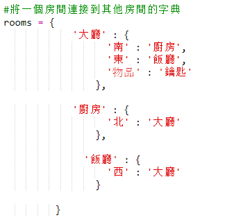

## 添加要收集的項目

讓我們把物品留在房間裡供玩家在迷宮中移動時收集。

+ 將項目添加到房間很容易，您只需將其添加到房間的字典中即可。 我們把鑰匙放在大廳裡。
    
    
    
    記得在新項目上方的行後面加上逗號，否則您的程序將無法運行！

+ 如果你在添加上面的代碼後運行你的遊戲，你現在可以在大廳看到一個鍵，你甚至可以拿起它（通過鍵入 `獲取鍵`）將其添加到你的庫存中！
    
    