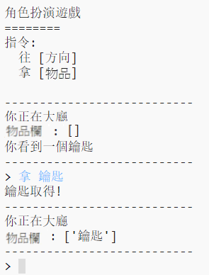

## 增加要收集的項目

讓我們把項目留在房間裡供玩家在迷宮中移動時收集。

--- task ---

新增一個物品到房間是很簡單的，你可以將它增加到房間字典。 讓我們在大廳裡放一把鑰匙。

記得在新物品的前一行最後面加上逗號，否則你的程式將無法運行！

--- code ---
---
language: python
line_highlights: 6-7
---
# 將一個房間連接到其他房間的字典
rooms = {

            '大廳' : {
                '南' : '廚房',
                '東' : '飯廳',
                '項目' : '鑰匙'
            },
    
            '廚房' : {
                '北' : '大廳'
            },
    
            '飯廳' : {
                '西' : '大廳'
            }
    
        }
--- /code ---

--- /task ---

--- task ---

如果你在增加上面的程式碼後執行遊戲，現在你可以在大廳看到一把鑰匙，甚至你可以撿起它（透過輸入`拿 鑰匙`），就會把它增加到你的物品欄中。

--- /task ---