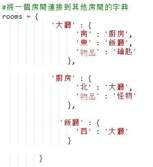
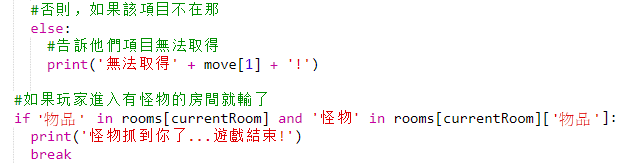

## 添加敵人

這個遊戲太簡單了！ 讓我們為玩家必須避免的一些房間添加敵人。

+ 將敵人添加到房間就像添加任何其他項目一樣簡單。 讓我們在廚房裡添加一個飢餓的怪物：
    
    

+ 如果玩家進入有怪物的房間，你還要確保遊戲結束。 您可以使用以下代碼執行此操作，您應該將其添加到遊戲結尾：
    
    
    
    此代碼檢查房間中是否有物品，如果是，則該物品是否為怪物。 請注意，此代碼是縮進的，使其與上面的代碼保持一致。 這意味著每次玩家進入新房間時遊戲都會檢查怪物。

+ 進入廚房，現在包含一個怪物，測試你的代碼。
    
    