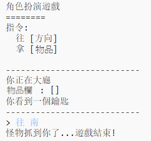

## 增加敵人

這個遊戲太簡單了！ 讓我們在一些房間增加敵人, 而玩家必須避開這些敵人。

--- task ---

增加一個敵人到一個房間就和新增物品一樣簡單。 讓我們在廚房裡增加一隻飢餓的怪物：

--- code ---
---
language: python
line_highlights: 11-12
---
# 將一個房間連接到其他房間的字典
rooms = {

            '大廳' : {
                '南' : '廚房',
                '東' : '餐廳',
                '項目' : '鑰匙'
            },
    
            '廚房' : {
                '北' : '大廳',
                '項目' : '怪獸'
            },
    
            '飯廳' : {
                '西' : '大廳'
            }
    
        }
--- /code ---

--- /task ---

--- task ---

還得確保玩家進入有怪物的房間時，遊戲結束。 你應該要將下列程式碼增加到遊戲的最後面，以執行這個條件：

--- code ---
---
language: python
line_highlights: 6-9
---
        ＃反之，如果想取得的物品不在那
        else:
            #告訴他們無法取得
            print(''無法取得' + move[1] + '!')
    
    #玩家若進入到一個有怪物的房間就輸了
    if '物品' in rooms[currentRoom] and 'monster' in rooms[currentRoom]['物品']:
        print('怪物抓到你了… 遊戲結束!')
        break
--- /code ---

此程式碼檢查房間中是否有項目，如果有，則檢查該項目是否是怪物。 請注意，這個程式碼是縮排的，讓它與上面的程式碼一致。 這代表著每次玩家進入新房間時，遊戲都會檢查有沒有怪物。

--- /task ---

--- task ---

透過進入有怪物的廚房來測試你的程式碼。

--- /task ---