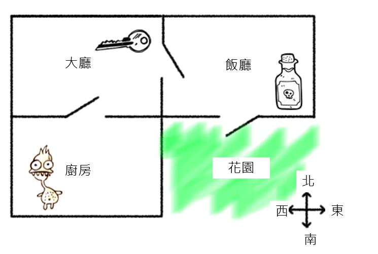
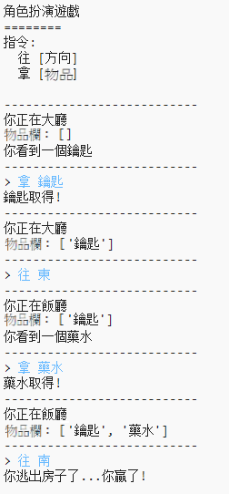
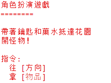

## 遊戲獲勝

讓我們給你的玩家一個任務，需要完成才能獲勝。

\--- task \---

在遊戲中，玩家得先逃離房屋且進入花園才能獲勝。 還需要擁有鑰匙和魔法藥水。 這是遊戲的地圖。

\--- /task \---

\--- task \---

首先，你需要在飯廳的南端增加一個花園。 記住要添加門，以連接到房屋中的其他房間。

## \--- code \---

language: python

## line_highlights: 16-17,18-22

# 將一個房間連接到其他房間的字典

rooms = {

            '大廳' : {
                '南' : '廚房',
                '東' : '飯廳',
                '項目' : '鑰匙'
            },
    
            '廚房' : {
                '北' : '大廳',
                '項目' : '怪獸'
            },
    
            '飯廳' : {
                '西' : '大廳'
            },
    
            '花園' : {
                '北' : '飯廳'
            }
    
        }
    

\--- /code \---

\--- /task \---

\--- task \---

在飯廳（或是房屋裡的任何一個房間）中新增藥水。

## \--- code \---

language: python

## line_highlights: 3-4

            '飯廳' : {
                      '西' : '大廳',
                      '南' : '花園',
                      '物品' : '藥水'
                    },
    

\--- /code \---

\--- /task \---

\--- task \---

增加以下程式碼，以使玩家在拿著鑰匙和藥水到達花園時贏得比賽：

## \--- code \---

language: python

## line_highlights: 6-9

# 如果玩家進入有怪物的房間就輸了

if '物品' in rooms\[currentRoom] and '怪物' in rooms[currentRoom\]\['物品'\]: print('怪物抓到你了… 遊戲結束!') break

# 玩家帶著鑰匙和藥水抵達花園就贏了

if currentRoom =='花園' and '鑰匙' and '藥水' in inventory: print('成功逃離房屋… 你贏了!') break

\--- /code \---

請注意，這個程式碼是縮排的，讓它與上面的程式碼一致。 這段程式碼代表如果玩家在房間4（花園）中，並且鑰匙和藥水都在物品欄裡，會顯示`成功逃離房屋...你贏了！`。

如果你有4個以上的房間，你需要在上面的程式碼中為花園加上不同的房間號碼。

\--- /task \---

\--- task \---

測試你的遊戲，確保玩家可以獲勝！

\--- /task \---

\--- task \---

最後，讓我們在你的遊戲中增加一些說明，以便玩家知道他們必須做什麼。 在`showInstructions()`函式加上更多說明。

## \--- code \---

language: python

## line_highlights: 7-8

def showInstructions(): #印出主選單與指令 print('''

# 角色扮演遊戲

帶著鑰匙和藥水抵達花園 躲避怪物！

指令: 往 [方向] 拿 [物品] ''')

\--- /code \---

你將需要增加的說明以告訴使用者他們需要收集哪些物品以及需要避免什麼！

\--- /task \---

\--- task \---

測試你的遊戲，你應該會看到你的新說明。

\--- /task \---