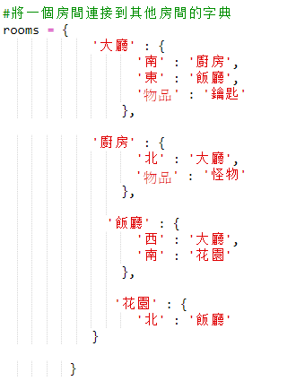
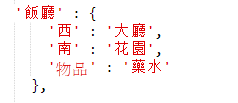
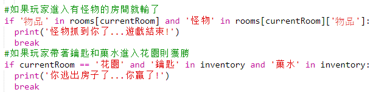
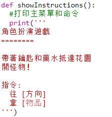

## 贏得比賽

讓我們給你的玩家一個任務，這需要完成以贏得比賽。

+ 在這個遊戲中，玩家通過到達花園並逃離房屋而獲勝。 他們還需要擁有鑰匙和魔法藥水。 這是一個遊戲地圖。
    
    

+ 首先，您需要在餐廳的南面添加一個花園。 記得加上門，連接到房子裡的其他房間。
    
    

+ 在餐廳（或你家裡的另一個房間）加入藥水。
    
    

+ 添加此代碼以允許玩家在使用鑰匙和藥水到達花園時贏得遊戲：
    
    
    
    確保此代碼縮進，與上面的代碼一致。 這段代碼意味著消息 `你逃離了房子......你贏了！` 如果玩家在室4（花園），並且如果密鑰和藥水是在庫存顯示。
    
    如果您有超過4間客房，您可能需要在上面的代碼中為您的花園使用不同的房間號碼。

+ 測試你的遊戲，以確保玩家能夠獲勝！
    
    

+ 最後，讓我們為您的遊戲添加一些說明，以便玩家知道他們必須做什麼。 編輯 `showInstructions（）` 函數以包含更多信息。
    
    
    
    您需要添加說明，告訴用戶他們需要收集哪些項目以及他們需要避免的內容！

+ 測試你的遊戲，你應該看到你的新指令。
    
    